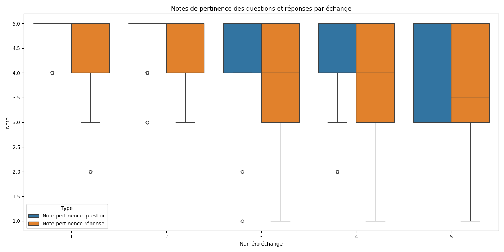
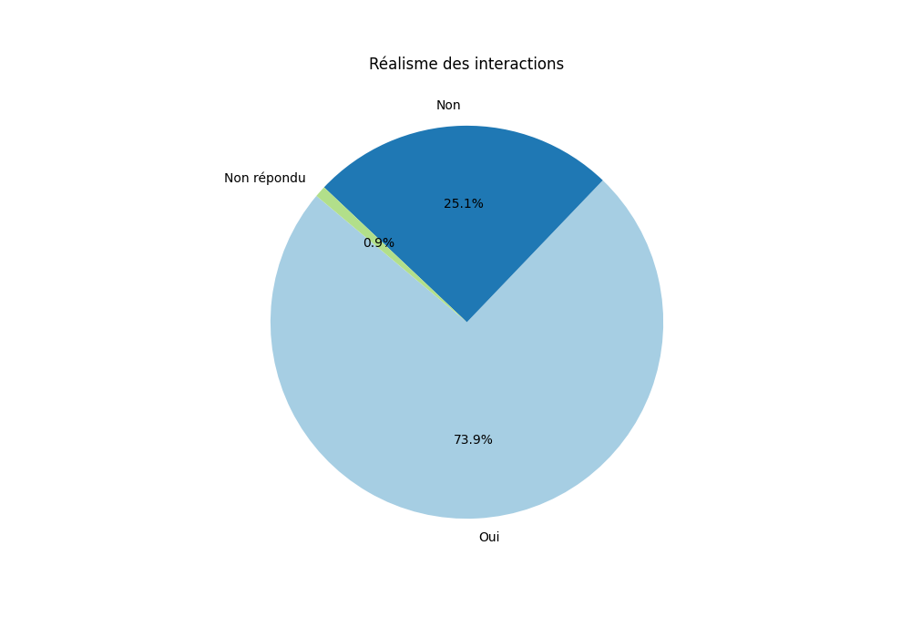

# Rapport Statistique

## Nombre total de conversations : 30
## Nombre total d'échanges : 150

## Graphiques

### Notes de pertinence des questions et réponses par échange

### Réalisme des interactions

## Statistiques pour Échange 1
### Note pertinence question
- **Moyenne**: 4.833333333333333
- **Médiane**: 5.0
- **Écart-type**: 0.3790490217894517
- **Min**: 4.0
- **Max**: 5.0
- **Nombre de valeurs**: 30
### Note pertinence réponse
- **Moyenne**: 4.433333333333334
- **Médiane**: 5.0
- **Écart-type**: 0.9714309861845772
- **Min**: 2
- **Max**: 5
- **Nombre de valeurs**: 30
### Réalisme interaction
- **Oui**: 80.0%
- **Non**: 16.67%
- **Non répondu**: 3.33%

## Statistiques pour Échange 2
### Note pertinence question
- **Moyenne**: 4.7
- **Médiane**: 5.0
- **Écart-type**: 0.5959634332684376
- **Min**: 3.0
- **Max**: 5.0
- **Nombre de valeurs**: 30
### Note pertinence réponse
- **Moyenne**: 4.366666666666666
- **Médiane**: 5.0
- **Écart-type**: 0.8087168778415268
- **Min**: 3
- **Max**: 5
- **Nombre de valeurs**: 30
### Réalisme interaction
- **Oui**: 76.67%
- **Non**: 20.0%
- **Non répondu**: 3.33%

## Statistiques pour Échange 3
### Note pertinence question
- **Moyenne**: 4.466666666666667
- **Médiane**: 5.0
- **Écart-type**: 0.9371024061116424
- **Min**: 1.0
- **Max**: 5.0
- **Nombre de valeurs**: 30
### Note pertinence réponse
- **Moyenne**: 3.7333333333333334
- **Médiane**: 4.0
- **Écart-type**: 1.2015315896469556
- **Min**: 1
- **Max**: 5
- **Nombre de valeurs**: 30
### Réalisme interaction
- **Oui**: 73.33%
- **Non**: 26.67%

## Statistiques pour Échange 4
### Note pertinence question
- **Moyenne**: 4.172413793103448
- **Médiane**: 4.0
- **Écart-type**: 1.0374751465953078
- **Min**: 2.0
- **Max**: 5.0
- **Nombre de valeurs**: 29
### Note pertinence réponse
- **Moyenne**: 3.933333333333333
- **Médiane**: 4.0
- **Écart-type**: 1.112106833535071
- **Min**: 1
- **Max**: 5
- **Nombre de valeurs**: 30
### Réalisme interaction
- **Oui**: 63.33%
- **Non**: 36.67%

## Statistiques pour Échange 5
### Note pertinence question
- **Moyenne**: 4.233333333333333
- **Médiane**: 5.0
- **Écart-type**: 0.8976341829703132
- **Min**: 3.0
- **Max**: 5.0
- **Nombre de valeurs**: 30
### Note pertinence réponse
- **Moyenne**: 3.6
- **Médiane**: 3.5
- **Écart-type**: 1.2757688689165259
- **Min**: 1
- **Max**: 5
- **Nombre de valeurs**: 30
### Réalisme interaction
- **Oui**: 53.33%
- **Non**: 46.67%

## Statistiques pour Global
### Note pertinence question
- **Moyenne**: 4.483221476510067
- **Médiane**: 5.0
- **Écart-type**: 0.835075873277535
- **Min**: 1.0
- **Max**: 5.0
- **Nombre de valeurs**: 149
### Note pertinence réponse
- **Moyenne**: 4.013333333333334
- **Médiane**: 4.0
- **Écart-type**: 1.123194549277073
- **Min**: 1
- **Max**: 5
- **Nombre de valeurs**: 150
### Réalisme interaction
- **Oui**: 69.33%
- **Non**: 29.33%
- **Non répondu**: 1.33%

## Conversations les plus mal notées
- **Moins pertinente** : conversation_6 (Score: 3.6)
- **Moins réaliste** : conversation_11 (Score: 0.0)
## Conversations les mieux notées
- **Plus pertinente** : conversation_12 (Score: 4.8)
- **Plus réaliste** : conversation_10 (Score: 100.0)
## Liste des conversations évaluées
### Nombre d'évaluations
- **conversation_1** : 10 évaluations
- **conversation_10** : 10 évaluations
- **conversation_11** : 5 évaluations
- **conversation_12** : 5 évaluations
- **conversation_13** : 5 évaluations
- **conversation_14** : 5 évaluations
- **conversation_15** : 5 évaluations
- **conversation_17** : 15 évaluations
- **conversation_18** : 5 évaluations
- **conversation_2** : 5 évaluations
- **conversation_3** : 10 évaluations
- **conversation_4** : 5 évaluations
- **conversation_5** : 10 évaluations
- **conversation_6** : 10 évaluations
- **conversation_7** : 15 évaluations
- **conversation_8** : 15 évaluations
- **conversation_9** : 15 évaluations
### Scores moyens
- **conversation_1** : Moyenne pertinence: 4.05, Réalisme moyen: 80.0%
- **conversation_10** : Moyenne pertinence: 4.65, Réalisme moyen: 100.0%
- **conversation_11** : Moyenne pertinence: 3.7, Réalisme moyen: 0.0%
- **conversation_12** : Moyenne pertinence: 4.8, Réalisme moyen: 100.0%
- **conversation_13** : Moyenne pertinence: 4.2, Réalisme moyen: 100.0%
- **conversation_14** : Moyenne pertinence: 4.5, Réalisme moyen: 60.0%
- **conversation_15** : Moyenne pertinence: 4.2, Réalisme moyen: 40.0%
- **conversation_17** : Moyenne pertinence: 4.233333333333333, Réalisme moyen: 80.0%
- **conversation_18** : Moyenne pertinence: 4.3, Réalisme moyen: 80.0%
- **conversation_2** : Moyenne pertinence: 4.7, Réalisme moyen: 80.0%
- **conversation_3** : Moyenne pertinence: 4.55, Réalisme moyen: 60.0%
- **conversation_4** : Moyenne pertinence: 4.8, Réalisme moyen: 100.0%
- **conversation_5** : Moyenne pertinence: 4.65, Réalisme moyen: 100.0%
- **conversation_6** : Moyenne pertinence: 3.6, Réalisme moyen: 30.0%
- **conversation_7** : Moyenne pertinence: 3.7333333333333334, Réalisme moyen: 66.66666666666666%
- **conversation_8** : Moyenne pertinence: 4.3, Réalisme moyen: 46.666666666666664%
- **conversation_9** : Moyenne pertinence: 4.133333333333334, Réalisme moyen: 66.66666666666666%
