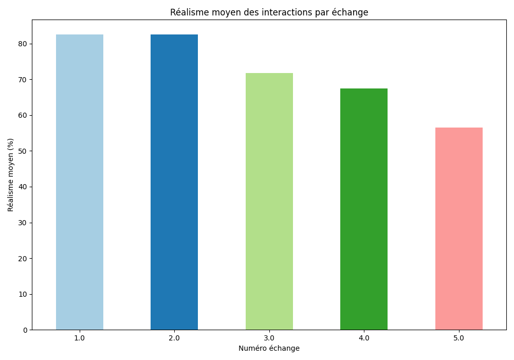

# Rapport Statistique

## Nombre total d'évaluation de conversations : 46
## Nombre total d'échanges évalués : 230

## Graphiques

### Notes de pertinence des questions et réponses par échange

### Réalisme des interactions

### Réalisme moyen des interactions par échange

## Statistiques pour Échange 1
### Note pertinence question
- **Moyenne**: 4.866666666666666
- **Médiane**: 5.0
- **Écart-type**: 0.3437758254761643
- **Min**: 4.0
- **Max**: 5.0
- **Nombre de valeurs**: 45
### Note pertinence réponse
- **Moyenne**: 4.511111111111111
- **Médiane**: 5.0
- **Écart-type**: 0.8692269873603531
- **Min**: 2.0
- **Max**: 5.0
- **Nombre de valeurs**: 45
### Réalisme interaction
- **Oui**: 84.44%
- **Non**: 13.33%
- **Non répondu**: 2.22%
### Réalisme moyen
- 84.44444444444444

## Statistiques pour Échange 2
### Note pertinence question
- **Moyenne**: 4.777777777777778
- **Médiane**: 5.0
- **Écart-type**: 0.5173748811807234
- **Min**: 3.0
- **Max**: 5.0
- **Nombre de valeurs**: 45
### Note pertinence réponse
- **Moyenne**: 4.488888888888889
- **Médiane**: 5.0
- **Écart-type**: 0.7268306737355188
- **Min**: 3.0
- **Max**: 5.0
- **Nombre de valeurs**: 45
### Réalisme interaction
- **Oui**: 84.44%
- **Non**: 13.33%
- **Non répondu**: 2.22%
### Réalisme moyen
- 84.44444444444444

## Statistiques pour Échange 3
### Note pertinence question
- **Moyenne**: 4.488888888888889
- **Médiane**: 5.0
- **Écart-type**: 0.8426749136535453
- **Min**: 1.0
- **Max**: 5.0
- **Nombre de valeurs**: 45
### Note pertinence réponse
- **Moyenne**: 3.888888888888889
- **Médiane**: 4.0
- **Écart-type**: 1.1123730207865246
- **Min**: 1.0
- **Max**: 5.0
- **Nombre de valeurs**: 45
### Réalisme interaction
- **Oui**: 73.33%
- **Non**: 26.67%
### Réalisme moyen
- 73.33333333333333

## Statistiques pour Échange 4
### Note pertinence question
- **Moyenne**: 4.090909090909091
- **Médiane**: 4.0
- **Écart-type**: 1.0958310389662929
- **Min**: 1.0
- **Max**: 5.0
- **Nombre de valeurs**: 44
### Note pertinence réponse
- **Moyenne**: 4.022222222222222
- **Médiane**: 4.0
- **Écart-type**: 1.0972877489703439
- **Min**: 1.0
- **Max**: 5.0
- **Nombre de valeurs**: 45
### Réalisme interaction
- **Oui**: 66.67%
- **Non**: 33.33%
### Réalisme moyen
- 66.66666666666666

## Statistiques pour Échange 5
### Note pertinence question
- **Moyenne**: 4.2
- **Médiane**: 5.0
- **Écart-type**: 0.9194860224356569
- **Min**: 2.0
- **Max**: 5.0
- **Nombre de valeurs**: 45
### Note pertinence réponse
- **Moyenne**: 3.6222222222222222
- **Médiane**: 4.0
- **Écart-type**: 1.2300940261343087
- **Min**: 1.0
- **Max**: 5.0
- **Nombre de valeurs**: 45
### Réalisme interaction
- **Oui**: 57.78%
- **Non**: 42.22%
### Réalisme moyen
- 57.77777777777777

## Statistiques pour Global
### Note pertinence question
- **Moyenne**: 4.486607142857143
- **Médiane**: 5.0
- **Écart-type**: 0.8416293759168284
- **Min**: 1.0
- **Max**: 5.0
- **Nombre de valeurs**: 224
### Note pertinence réponse
- **Moyenne**: 4.1066666666666665
- **Médiane**: 4.0
- **Écart-type**: 1.072047440314893
- **Min**: 1.0
- **Max**: 5.0
- **Nombre de valeurs**: 225
### Réalisme interaction
- **Oui**: 73.33%
- **Non**: 25.78%
- **Non répondu**: 0.89%

## Conversations les plus mal notées
- **Moins pertinente** : conversation_7 (Score: 3.7333333333333334)
- **Moins réaliste** : conversation_11 (Score: 40.0)
## Conversations les mieux notées
- **Plus pertinente** : conversation_12 (Score: 4.8)
- **Plus réaliste** : conversation_10 (Score: 100.0)
## Liste des conversations évaluées
### Nombre d'évaluations
- **conversation_1** : 2.0 évaluations
- **conversation_10** : 4.0 évaluations
- **conversation_11** : 2.0 évaluations
- **conversation_12** : 1.0 évaluations
- **conversation_13** : 2.0 évaluations
- **conversation_14** : 1.0 évaluations
- **conversation_15** : 1.0 évaluations
- **conversation_16** : 2.0 évaluations
- **conversation_17** : 4.0 évaluations
- **conversation_18** : 3.0 évaluations
- **conversation_2** : 2.0 évaluations
- **conversation_3** : 4.0 évaluations
- **conversation_4** : 1.0 évaluations
- **conversation_5** : 3.0 évaluations
- **conversation_6** : 4.0 évaluations
- **conversation_7** : 3.0 évaluations
- **conversation_8** : 3.0 évaluations
- **conversation_9** : 3.0 évaluations
### Scores moyens
- **conversation_1** : Moyenne pertinence: 4.05, Réalisme moyen: 80.0%
- **conversation_10** : Moyenne pertinence: 4.7, Réalisme moyen: 100.0%
- **conversation_11** : Moyenne pertinence: 3.8, Réalisme moyen: 40.0%
- **conversation_12** : Moyenne pertinence: 4.8, Réalisme moyen: 100.0%
- **conversation_13** : Moyenne pertinence: 4.55, Réalisme moyen: 100.0%
- **conversation_14** : Moyenne pertinence: 4.5, Réalisme moyen: 60.0%
- **conversation_15** : Moyenne pertinence: 4.2, Réalisme moyen: 40.0%
- **conversation_16** : Moyenne pertinence: 4.65, Réalisme moyen: 80.0%
- **conversation_17** : Moyenne pertinence: 4.28, Réalisme moyen: 85.0%
- **conversation_18** : Moyenne pertinence: 4.4, Réalisme moyen: 87.0%
- **conversation_2** : Moyenne pertinence: 4.3, Réalisme moyen: 50.0%
- **conversation_3** : Moyenne pertinence: 4.58, Réalisme moyen: 75.0%
- **conversation_4** : Moyenne pertinence: 4.8, Réalisme moyen: 100.0%
- **conversation_5** : Moyenne pertinence: 4.4, Réalisme moyen: 87.0%
- **conversation_6** : Moyenne pertinence: 3.8, Réalisme moyen: 50.0%
- **conversation_7** : Moyenne pertinence: 3.73, Réalisme moyen: 67.0%
- **conversation_8** : Moyenne pertinence: 4.3, Réalisme moyen: 47.0%
- **conversation_9** : Moyenne pertinence: 4.13, Réalisme moyen: 67.0%
