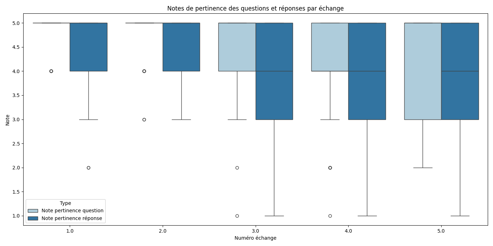

# Rapport Statistique

## Nombre total d'évaluation de conversations : 47
## Nombre total d'échanges évalués : 235

## Graphiques

### Notes de pertinence des questions et réponses par échange

### Réalisme des interactions

### Réalisme moyen des interactions par échange

## Statistiques pour Échange 1
### Note pertinence question
- **Moyenne**: 4.869565217391305
- **Médiane**: 5.0
- **Écart-type**: 0.3405026123034994
- **Min**: 4.0
- **Max**: 5.0
- **Nombre de valeurs**: 46
### Note pertinence réponse
- **Moyenne**: 4.521739130434782
- **Médiane**: 5.0
- **Écart-type**: 0.8625319429777688
- **Min**: 2.0
- **Max**: 5.0
- **Nombre de valeurs**: 46
### Réalisme interaction
- **Oui**: 82.61%
- **Non**: 15.22%
- **Non répondu**: 2.17%
### Réalisme moyen
- 82.6086956521739

## Statistiques pour Échange 2
### Note pertinence question
- **Moyenne**: 4.782608695652174
- **Médiane**: 5.0
- **Écart-type**: 0.5126421094361541
- **Min**: 3.0
- **Max**: 5.0
- **Nombre de valeurs**: 46
### Note pertinence réponse
- **Moyenne**: 4.5
- **Médiane**: 5.0
- **Écart-type**: 0.7226494462892933
- **Min**: 3.0
- **Max**: 5.0
- **Nombre de valeurs**: 46
### Réalisme interaction
- **Oui**: 82.61%
- **Non**: 15.22%
- **Non répondu**: 2.17%
### Réalisme moyen
- 82.6086956521739

## Statistiques pour Échange 3
### Note pertinence question
- **Moyenne**: 4.5
- **Médiane**: 5.0
- **Écart-type**: 0.8366600265340756
- **Min**: 1.0
- **Max**: 5.0
- **Nombre de valeurs**: 46
### Note pertinence réponse
- **Moyenne**: 3.9130434782608696
- **Médiane**: 4.0
- **Écart-type**: 1.1120768749710654
- **Min**: 1.0
- **Max**: 5.0
- **Nombre de valeurs**: 46
### Réalisme interaction
- **Oui**: 71.74%
- **Non**: 28.26%
### Réalisme moyen
- 71.73913043478261

## Statistiques pour Échange 4
### Note pertinence question
- **Moyenne**: 4.111111111111111
- **Médiane**: 4.0
- **Écart-type**: 1.0917505172516258
- **Min**: 1.0
- **Max**: 5.0
- **Nombre de valeurs**: 45
### Note pertinence réponse
- **Moyenne**: 4.043478260869565
- **Médiane**: 4.0
- **Écart-type**: 1.0945627587535773
- **Min**: 1.0
- **Max**: 5.0
- **Nombre de valeurs**: 46
### Réalisme interaction
- **Oui**: 67.39%
- **Non**: 32.61%
### Réalisme moyen
- 67.3913043478261

## Statistiques pour Échange 5
### Note pertinence question
- **Moyenne**: 4.217391304347826
- **Médiane**: 5.0
- **Écart-type**: 0.9168313422570848
- **Min**: 2.0
- **Max**: 5.0
- **Nombre de valeurs**: 46
### Note pertinence réponse
- **Moyenne**: 3.5652173913043477
- **Médiane**: 4.0
- **Écart-type**: 1.2763171656161243
- **Min**: 1.0
- **Max**: 5.0
- **Nombre de valeurs**: 46
### Réalisme interaction
- **Oui**: 56.52%
- **Non**: 43.48%
### Réalisme moyen
- 56.52173913043478

## Statistiques pour Global
### Note pertinence question
- **Moyenne**: 4.497816593886463
- **Médiane**: 5.0
- **Écart-type**: 0.835739268019279
- **Min**: 1.0
- **Max**: 5.0
- **Nombre de valeurs**: 229
### Note pertinence réponse
- **Moyenne**: 4.108695652173913
- **Médiane**: 5.0
- **Écart-type**: 1.0864038845741004
- **Min**: 1.0
- **Max**: 5.0
- **Nombre de valeurs**: 230
### Réalisme interaction
- **Oui**: 72.17%
- **Non**: 26.96%
- **Non répondu**: 0.87%

## Conversations les plus mal notées
- **Moins pertinente** : conversation_7 (Score: 3.7333333333333334)
- **Moins réaliste** : conversation_11 (Score: 40.0)
## Conversations les mieux notées
- **Plus pertinente** : conversation_12 (Score: 4.8)
- **Plus réaliste** : conversation_10 (Score: 100.0)
## Liste des conversations évaluées
### Nombre d'évaluations
- **conversation_1** : 2.0 évaluations
- **conversation_10** : 4.0 évaluations
- **conversation_11** : 2.0 évaluations
- **conversation_12** : 1.0 évaluations
- **conversation_13** : 2.0 évaluations
- **conversation_14** : 1.0 évaluations
- **conversation_15** : 1.0 évaluations
- **conversation_16** : 2.0 évaluations
- **conversation_17** : 4.0 évaluations
- **conversation_18** : 3.0 évaluations
- **conversation_2** : 2.0 évaluations
- **conversation_3** : 4.0 évaluations
- **conversation_4** : 1.0 évaluations
- **conversation_5** : 3.0 évaluations
- **conversation_6** : 4.0 évaluations
- **conversation_7** : 3.0 évaluations
- **conversation_8** : 3.0 évaluations
- **conversation_9** : 4.0 évaluations
### Scores moyens
- **conversation_1** : Moyenne pertinence: 4.05, Réalisme moyen: 80.0%
- **conversation_10** : Moyenne pertinence: 4.7, Réalisme moyen: 100.0%
- **conversation_11** : Moyenne pertinence: 3.8, Réalisme moyen: 40.0%
- **conversation_12** : Moyenne pertinence: 4.8, Réalisme moyen: 100.0%
- **conversation_13** : Moyenne pertinence: 4.55, Réalisme moyen: 100.0%
- **conversation_14** : Moyenne pertinence: 4.5, Réalisme moyen: 60.0%
- **conversation_15** : Moyenne pertinence: 4.2, Réalisme moyen: 40.0%
- **conversation_16** : Moyenne pertinence: 4.65, Réalisme moyen: 80.0%
- **conversation_17** : Moyenne pertinence: 4.28, Réalisme moyen: 85.0%
- **conversation_18** : Moyenne pertinence: 4.4, Réalisme moyen: 87.0%
- **conversation_2** : Moyenne pertinence: 4.3, Réalisme moyen: 50.0%
- **conversation_3** : Moyenne pertinence: 4.58, Réalisme moyen: 75.0%
- **conversation_4** : Moyenne pertinence: 4.8, Réalisme moyen: 100.0%
- **conversation_5** : Moyenne pertinence: 4.4, Réalisme moyen: 87.0%
- **conversation_6** : Moyenne pertinence: 3.8, Réalisme moyen: 50.0%
- **conversation_7** : Moyenne pertinence: 3.73, Réalisme moyen: 67.0%
- **conversation_8** : Moyenne pertinence: 4.3, Réalisme moyen: 47.0%
- **conversation_9** : Moyenne pertinence: 4.25, Réalisme moyen: 55.00000000000001%
