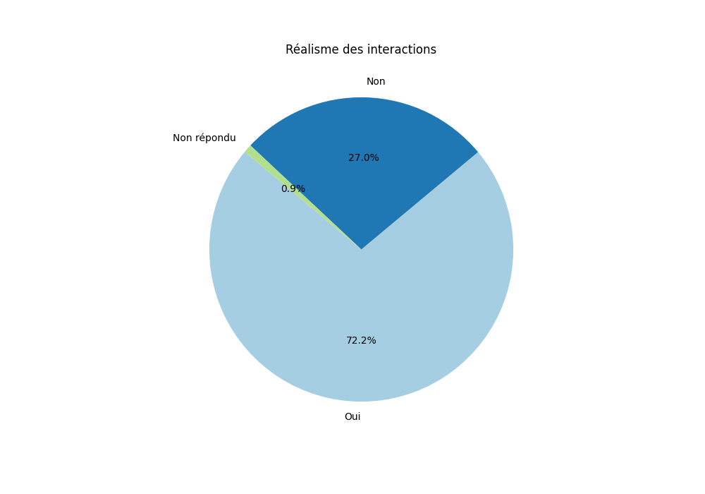

# Rapport Statistique

## Nombre total de conversations : 43
## Nombre total d'échanges : 215

## Graphiques

### Notes de pertinence des questions et réponses par échange

### Réalisme des interactions

### Réalisme moyen des interactions par échange

## Statistiques pour Échange 1
### Note pertinence question
- **Moyenne**: 4.8604651162790695
- **Médiane**: 5.0
- **Écart-type**: 0.350604603563426
- **Min**: 4.0
- **Max**: 5.0
- **Nombre de valeurs**: 43
### Note pertinence réponse
- **Moyenne**: 4.511627906976744
- **Médiane**: 5.0
- **Écart-type**: 0.8829628968976533
- **Min**: 2
- **Max**: 5
- **Nombre de valeurs**: 43
### Réalisme interaction
- **Oui**: 83.72%
- **Non**: 13.95%
- **Non répondu**: 2.33%
### Réalisme moyen
- 83.72093023255815

## Statistiques pour Échange 2
### Note pertinence question
- **Moyenne**: 4.767441860465116
- **Médiane**: 5.0
- **Écart-type**: 0.5272213460490666
- **Min**: 3.0
- **Max**: 5.0
- **Nombre de valeurs**: 43
### Note pertinence réponse
- **Moyenne**: 4.465116279069767
- **Médiane**: 5.0
- **Écart-type**: 0.7351331984685407
- **Min**: 3
- **Max**: 5
- **Nombre de valeurs**: 43
### Réalisme interaction
- **Oui**: 83.72%
- **Non**: 13.95%
- **Non répondu**: 2.33%
### Réalisme moyen
- 83.72093023255815

## Statistiques pour Échange 3
### Note pertinence question
- **Moyenne**: 4.488372093023256
- **Médiane**: 5.0
- **Écart-type**: 0.8555725741740722
- **Min**: 1.0
- **Max**: 5.0
- **Nombre de valeurs**: 43
### Note pertinence réponse
- **Moyenne**: 3.86046511627907
- **Médiane**: 4.0
- **Écart-type**: 1.125069211603006
- **Min**: 1
- **Max**: 5
- **Nombre de valeurs**: 43
### Réalisme interaction
- **Oui**: 76.74%
- **Non**: 23.26%
### Réalisme moyen
- 76.74418604651163

## Statistiques pour Échange 4
### Note pertinence question
- **Moyenne**: 4.142857142857143
- **Médiane**: 4.0
- **Écart-type**: 1.0017406453556186
- **Min**: 2.0
- **Max**: 5.0
- **Nombre de valeurs**: 42
### Note pertinence réponse
- **Moyenne**: 4.069767441860465
- **Médiane**: 4.0
- **Écart-type**: 1.0778141203205438
- **Min**: 1
- **Max**: 5
- **Nombre de valeurs**: 43
### Réalisme interaction
- **Oui**: 67.44%
- **Non**: 32.56%
### Réalisme moyen
- 67.44186046511628

## Statistiques pour Échange 5
### Note pertinence question
- **Moyenne**: 4.209302325581396
- **Médiane**: 5.0
- **Écart-type**: 0.9400643223910575
- **Min**: 2.0
- **Max**: 5.0
- **Nombre de valeurs**: 43
### Note pertinence réponse
- **Moyenne**: 3.604651162790698
- **Médiane**: 4.0
- **Écart-type**: 1.2562137913989786
- **Min**: 1
- **Max**: 5
- **Nombre de valeurs**: 43
### Réalisme interaction
- **Oui**: 58.14%
- **Non**: 41.86%
### Réalisme moyen
- 58.139534883720934

## Statistiques pour Global
### Note pertinence question
- **Moyenne**: 4.4953271028037385
- **Médiane**: 5.0
- **Écart-type**: 0.8207843697971494
- **Min**: 1.0
- **Max**: 5.0
- **Nombre de valeurs**: 214
### Note pertinence réponse
- **Moyenne**: 4.102325581395349
- **Médiane**: 5.0
- **Écart-type**: 1.0803011807662548
- **Min**: 1
- **Max**: 5
- **Nombre de valeurs**: 215
### Réalisme interaction
- **Oui**: 73.95%
- **Non**: 25.12%
- **Non répondu**: 0.93%

## Conversations les plus mal notées
- **Moins pertinente** : conversation_7 (Score: 3.7333333333333334)
- **Moins réaliste** : conversation_11 (Score: 40.0)
## Conversations les mieux notées
- **Plus pertinente** : conversation_12 (Score: 4.8)
- **Plus réaliste** : conversation_10 (Score: 100.0)
## Liste des conversations évaluées
### Nombre d'évaluations
- **conversation_1** : 2.0 évaluations
- **conversation_10** : 4.0 évaluations
- **conversation_11** : 2.0 évaluations
- **conversation_12** : 1.0 évaluations
- **conversation_13** : 2.0 évaluations
- **conversation_14** : 1.0 évaluations
- **conversation_15** : 1.0 évaluations
- **conversation_16** : 1.0 évaluations
- **conversation_17** : 4.0 évaluations
- **conversation_18** : 3.0 évaluations
- **conversation_2** : 2.0 évaluations
- **conversation_3** : 4.0 évaluations
- **conversation_4** : 1.0 évaluations
- **conversation_5** : 2.0 évaluations
- **conversation_6** : 4.0 évaluations
- **conversation_7** : 3.0 évaluations
- **conversation_8** : 3.0 évaluations
- **conversation_9** : 3.0 évaluations
### Scores moyens
- **conversation_1** : Moyenne pertinence: 4.05, Réalisme moyen: 80.0%
- **conversation_10** : Moyenne pertinence: 4.7, Réalisme moyen: 100.0%
- **conversation_11** : Moyenne pertinence: 3.8, Réalisme moyen: 40.0%
- **conversation_12** : Moyenne pertinence: 4.8, Réalisme moyen: 100.0%
- **conversation_13** : Moyenne pertinence: 4.55, Réalisme moyen: 100.0%
- **conversation_14** : Moyenne pertinence: 4.5, Réalisme moyen: 60.0%
- **conversation_15** : Moyenne pertinence: 4.2, Réalisme moyen: 40.0%
- **conversation_16** : Moyenne pertinence: 4.7, Réalisme moyen: 100.0%
- **conversation_17** : Moyenne pertinence: 4.28, Réalisme moyen: 85.0%
- **conversation_18** : Moyenne pertinence: 4.4, Réalisme moyen: 87.0%
- **conversation_2** : Moyenne pertinence: 4.3, Réalisme moyen: 50.0%
- **conversation_3** : Moyenne pertinence: 4.58, Réalisme moyen: 75.0%
- **conversation_4** : Moyenne pertinence: 4.8, Réalisme moyen: 100.0%
- **conversation_5** : Moyenne pertinence: 4.65, Réalisme moyen: 100.0%
- **conversation_6** : Moyenne pertinence: 3.8, Réalisme moyen: 50.0%
- **conversation_7** : Moyenne pertinence: 3.73, Réalisme moyen: 67.0%
- **conversation_8** : Moyenne pertinence: 4.3, Réalisme moyen: 47.0%
- **conversation_9** : Moyenne pertinence: 4.13, Réalisme moyen: 67.0%
